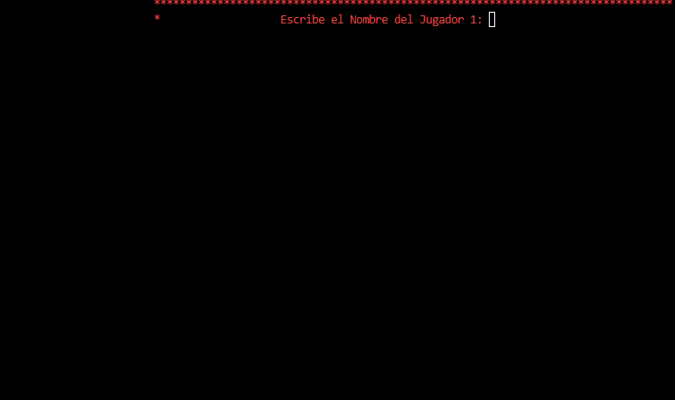

[](README.es.md)

# 🃏 Letter Cards - Classic Memory Matching Game


A console-based memory game developed in C++ with multiplatform support. This classic two-player game challenges participants to find letter pairs on a 6×6 grid, tracking time, moves, and errors.

---

## 🎬 Preview

<div align="center">
  
</div>

---

## 👨‍🎓 Developer Info

- **Developer:** Carlos Gabriel Magallanes López
- **Email:** cgmagallanes23@gmail.com
- **Development Date:** June 7, 2025

---

## 🎮 Game Description

Letter Cards is a terminal implementation of the classic Memorama memory game. Two players take turns flipping cards to find letter pairs. The game features a 6×6 grid with 18 unique letter pairs (36 cards total), with move tracking, error counting, and a game timer.

### Key Features
- **Two-Player Mode:** Competitive gameplay for two people
- **6×6 Grid:** 36 cards with 18 pairs (A–R)
- **Real-Time Scoring:** Track points, moves, and errors
- **Multiplatform:** Works on Windows, Linux, and macOS
- **Colored Console:** Enhanced visual experience with colored text
- **Game Statistics:** Timer, move counter, and error analysis
- **Input Validation:** Robust error handling for user input

---

## 🎯 How to Play

### Setup
1. **Launch the game** — Double-click the executable file
2. **Enter names** — Both players type their name
3. **Wait for load** — Brief loading animation
4. **Start playing** — Cards are shuffled and hidden as 'X'

### Game Rules
- **Turns:** Players alternate choosing two cards using row and column coordinates
- **Match found:** The player scores a point and keeps their turn
- **No match:** Cards are flipped back and the turn passes to the other player
- **Winner:** The player with the most pairs when all 18 are found wins
- **Extra Data:** The game records total time, moves, and errors

### Game Controls

| Input | Description |
|-------|-------------|
| **Row (0–5)** | Enter the card's row number |
| **Column (0–5)** | Enter the card's column number |
| **Numbers Only** | Validation ensures correct data type |

### Card Selection Process
1. **First Card:**
   - Enter row coordinate (0–5)
   - Enter column coordinate (0–5)
   - Card is revealed on the board
2. **Second Card:**
   - Enter row coordinate (0–5)
   - Enter column coordinate (0–5)
   - Card is revealed for comparison
3. **Match Logic:**
   - Cards match → Point awarded, cards stay visible
   - No match → Cards return to 'X', turn changes

---

## 📊 Board Design

```
Grid Coordinates:
        0 1 2 3 4 5
    0   X X X X X X
    1   X X X X X X
    2   X X X X X X
    3   X X X X X X
    4   X X X X X X
    5   X X X X X X

After revealing some cards:
        0 1 2 3 4 5
    0   A X B X C X
    1   X D X D X E
    2   F X X X A X
    3   X X G X X H
    4   X B X X X X
    5   X X X X X X
```

---

## 🏆 Scoring System

### Point Assignment
- **+1 Point:** For each pair found
- **No Penalty:** Failed attempts do not subtract points
- **Turn Continuation:** Finding a pair keeps your turn active

### Recorded Statistics
- **Individual Scores:** Total pairs found per player
- **Total Moves:** Number of card pair selections
- **Errors:** Failed attempts + invalid selections
- **Game Duration:** Total time in minutes and seconds
- **Winner Declaration:** Highest score announcement or draw

### Final Results Screen
```
******************************************************************
*                      Game Over!                               *
******************************************************************
*         Player 1: 10 points                                   *
*         Player 2: 8 points                                    *
*         Total Moves: 25                                       *
*         Errors: 7                                             *
*         Time: 5 min, 32 sec                                   *
******************************************************************
```

---

## 💻 Technical Implementation

### Core Architecture
```cpp
Main Components:
1. Card Grid System (6x6 matrix)
2. Input Validation Engine
3. Turn Management System
4. Score & Statistics Tracker
5. Multiplatform Console Control
6. Stopwatch and Timer
7. Random Shuffle Algorithm
```

### Multiplatform Support

#### Supported Operating Systems

| Platform | Minimum Version | Recommended Version |
|----------|----------------|---------------------|
| **Windows** | Windows 10 | Windows 10 / 11 |
| **Linux** | Ubuntu 18.04+ | Ubuntu 22.04+ |
| **macOS** | macOS 10.14 | macOS 12 Monterey+ |

#### Platform Functionality
```cpp
// Clear screen
#ifdef _WIN32
    system("cls");          // Windows
#else
    system("clear");        // POSIX
#endif

// Console colors
Windows: SetConsoleTextAttribute()
POSIX:   ANSI escape codes (\033[code])

// Audio feedback
Windows: Beep(frequency, duration)
POSIX:   Bell character (\a)
```

### Data Structures
```cpp
// Letter pair storage
std::vector<std::string> letters(18);    // Unique letters A-R
std::vector<std::string> pairs(36);      // 18 duplicated pairs

// Game board matrices
std::vector<std::vector<std::string>> board(6x6);         // Actual cards
std::vector<std::vector<std::string>> visibleCards(6x6);  // Player view

// Player info
std::vector<std::string> playerNames(2);  // Both player names
```

### Key Algorithms

#### Card Shuffle
```cpp
Fisher-Yates Shuffle Algorithm:
- Generate 36 random positions
- Swap cards to randomize placement
- Guarantees fair distribution
```

#### Match Detection
```cpp
Comparison Logic:
- Reveal first card at [row1][col1]
- Reveal second card at [row2][col2]
- Compare board[row1][col1] == board[row2][col2]
- Update game state based on result
```

#### Input Validation
```cpp
Multi-Layer Validation:
1. Type check (integers only)
2. Range validation (0-5)
3. Card state check (not already revealed)
4. Duplicate selection prevention (same card twice)
```

---

## 🎨 Visual Design

### Console Color Scheme
- **Main Text:** Red (`colorCode: 4`)
- **Game Board:** White background with colored text
- **Error Messages:** Highlighted error boxes
- **Success Messages:** Celebration boxes with sound

### ASCII Art Elements
- **Title Screen:** Large "MEMORAMA" banner
- **Victory Screen:** "CONGRATULATIONS"
- **Draw Screen:** "DRAW"
- **Error Boxes:** Bordered error notifications

---

## 📚 Learning Outcomes

### For Players
- ✅ **Memory Training:** Improves short-term memory skills
- ✅ **Pattern Recognition:** Identify and remember card positions
- ✅ **Strategic Thinking:** Decide when to take risks
- ✅ **Competitive Play:** Two-player experience

### For Developers

🎓 **C++ Fundamentals**
- Vector and matrix manipulation
- String handling and comparison
- Function organization and modularity
- Namespace and alias usage

🎓 **Multiplatform Development**
- Conditional compilation (`#ifdef`)
- Platform-specific APIs
- POSIX vs Windows differences
- Portable code design

🎓 **I/O Management**
- Console input validation
- Stream error handling (`cin.fail()`)
- Buffer cleanup techniques
- Formatted console output

🎓 **Game Logic Implementation**
- Turn-based systems
- State management (revealed/hidden cards)
- Win condition detection
- Error recovery mechanisms

🎓 **Timing and Threading**
- Chrono library usage
- Duration calculations
- Thread-based pauses
- Real-time tracking

🎓 **Algorithm Design**
- Random shuffling
- Grid traversal
- Coordinate mapping
- Validation logic

---

## 🎮 Feature Breakdown

### Error Handling

| Error Type | Message | Cause |
|------------|---------|-------|
| **Range Error** | "Out of Range (Numbers 0–5)" | Input < 0 or > 5 |
| **Type Error** | "Invalid Input. Enter a Number" | Non-integer input |
| **Card Error** | "That Card is already revealed" | Revealed card selected |
| **Same Card** | "You already chose that Card as First" | Duplicate selection |
| **Empty Name** | "Name cannot be empty" | Blank player name |

### Validation System
```
Input Flow:
Input → Type Check → Range Check → State Check → Accept/Reject
            ↓               ↓               ↓
       Error Message   Error Message   Error Message
```

### Stopwatch System
- **Start:** Timer begins on the first move
- **Tracking:** Real-time duration measurement
- **End:** Timer stops when the last pair is found
- **Display:** Converted to minutes and seconds

---

## 💡 Strategy Tips

### For Best Results
- **Mental Mapping:** Build a mental map of revealed cards
- **Pattern Memory:** Remember letter positions, not just pairs
- **Risk vs Reward:** Sometimes guessing reveals new information
- **Observation:** Use your opponent's failed attempts as clues
- **Early Game:** Explore different areas of the board
- **Late Game:** Use accumulated knowledge to win fast

---

## 📥 Download & Play

### Quick Start — No Installation!

Just download and play! This game is distributed as a standalone executable that runs directly without any installation process.

1. **Download** the executable (`LetterCards.exe`) from [Releases](../../releases)
2. **Double-click** to launch the game
3. **Start playing** immediately — no setup needed!

### System Requirements

| Component | Requirement |
|-----------|-------------|
| **OS** | Windows 10/11, Linux (Ubuntu 18.04+), macOS 10.14+ |
| **RAM** | 20 MB minimum |
| **Storage** | ~4 MB free space |
| **Display** | Terminal/console window |
| **Dependencies** | None — all libraries statically linked |

### Why No Hassle?
- ✅ No installation complications
- ✅ No dependencies to download
- ✅ No configuration needed
- ✅ Just download and play!

---

## 🌐 Language Note

The game interface is currently in **Spanish**. Error messages, prompts, and victory screens are displayed in Spanish, making it ideal for Spanish-speaking players or those learning the language.

---

## 📞 Contact & Support

- **Developer:** Carlos Gabriel Magallanes López
- **Email:** cgmagallanes23@gmail.com

Found a bug? Have suggestions? Want to report your high score? Feel free to reach out!

---

### 🃏 Test your memory and compete with friends in this classic matching game! 🎯

**Ideal for:**
- Memory training and cognitive development
- Competitive two-player gameplay
- Learning C++ game development
- Understanding multiplatform programming
- Studying console interface design

**Challenge your mind and have fun!** 🧠✨
